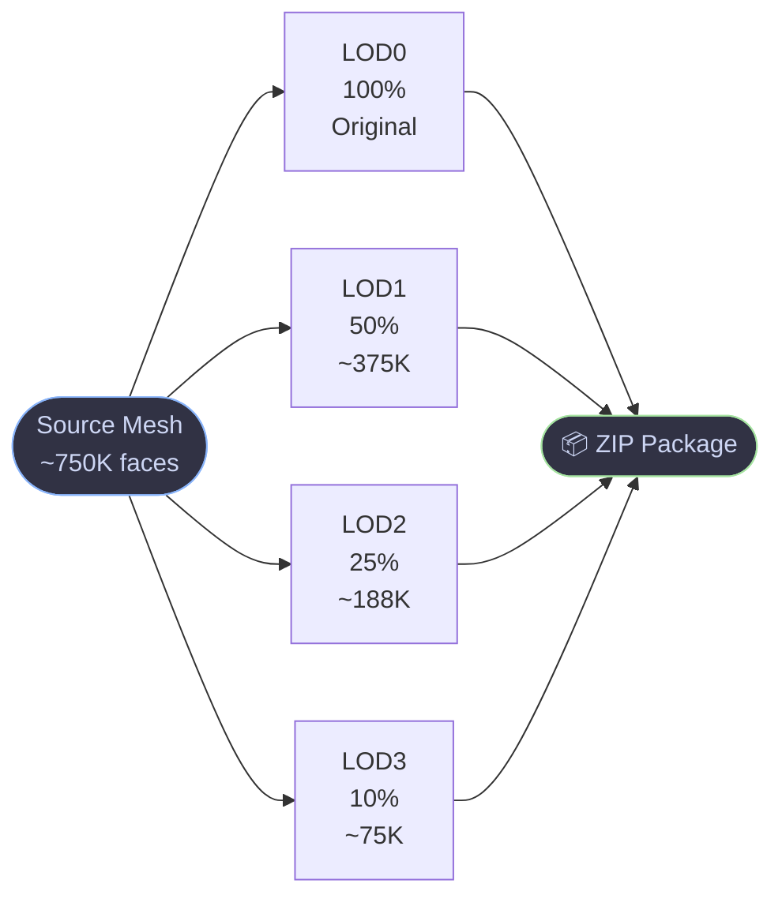
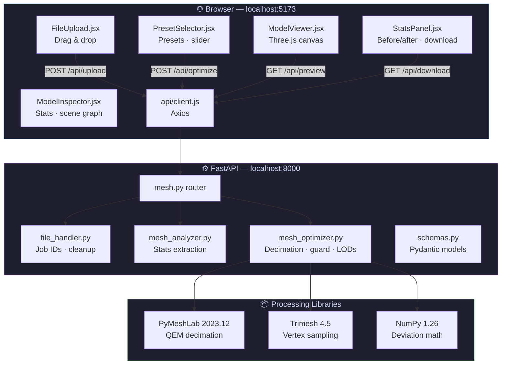
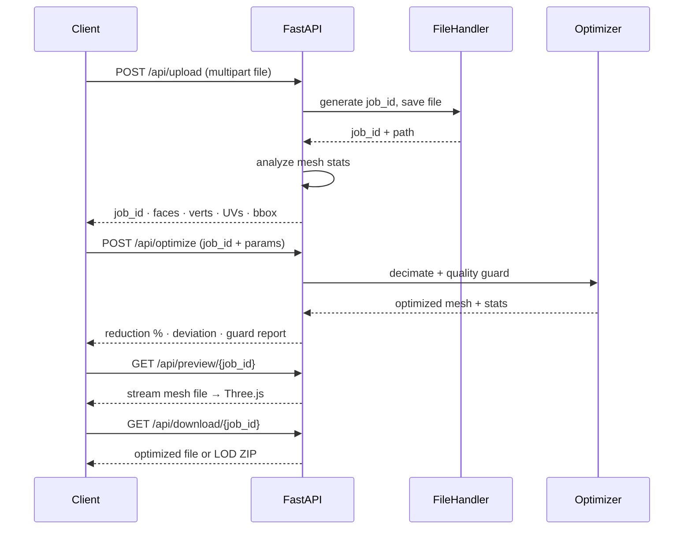
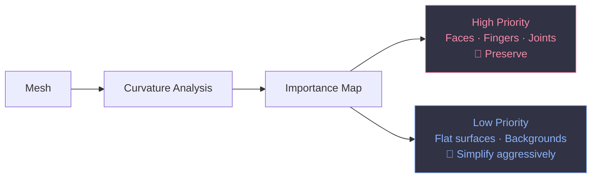
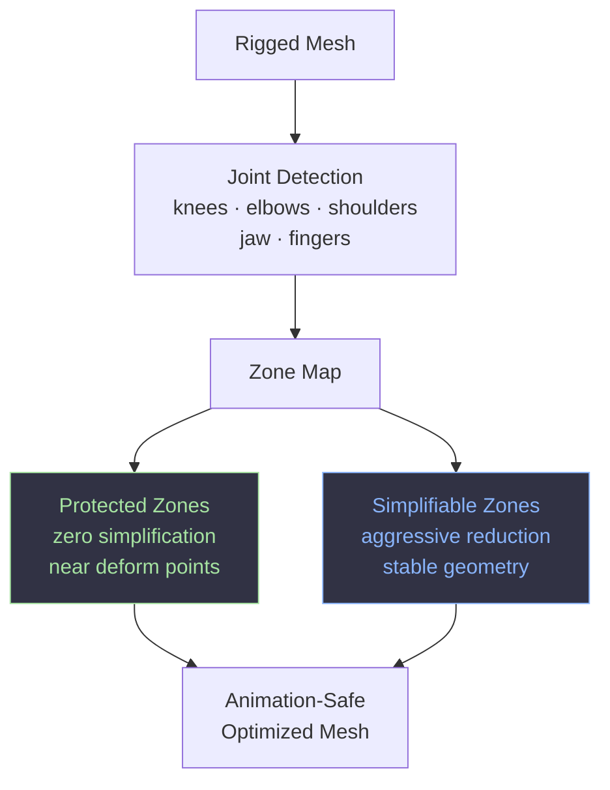
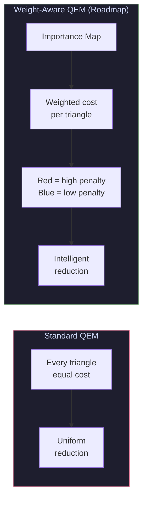

# Crunch3D

> Intelligent 3D mesh optimization. Not just smaller — smarter.

Crunch3D is a full-stack mesh optimization platform built for developers and 3D artists who need production-ready assets without the hours of manual retopology. AI-generated meshes from Tripo3D, Meshy, and Shap-E ship with 700K–800K+ polygons. They're beautiful. They're also completely unusable in real-time environments.

Crunch3D fixes that.

---

## The Problem

| Tool | What It Does | What It Misses |
|---|---|---|
| Traditional decimators | Reduce polygon count | Treat every triangle equally |
| Manual retopology | Full artist control | Takes hours, costs $300–500/mo in software |
| **Crunch3D** | **Intelligent reduction** | **Nothing — that's the point** |

Standard mesh optimization tools apply the same reduction uniformly across a mesh. A face gets the same priority as a fingertip. An empty background surface gets the same protection as a mechanical joint.

Crunch3D is designed around a different premise: **understand what matters before you optimize.**

---

## How It Works

Upload a mesh. Crunch3D analyzes it instantly — face count, vertex count, UVs, normals, bounding box. Pick a platform preset or dial in a custom face target. The optimization engine samples the original geometry, runs QEM decimation, and checks the result against your quality threshold before accepting it. If the shape deviates too much, it retries at a less aggressive target automatically. Output is either a single optimized file or a full LOD package, ready to download.

---

## Current Capabilities

### Mesh Upload & Analysis
- OBJ, STL, PLY, GLB, GLTF, FBX, OFF up to 50MB
- Instant face count, vertex count, and file size analysis
- UV presence, normals, and bounding box inspection

### Intelligent Mesh Optimization
- Quadric Error Metrics (QEM) simplification via PyMeshLab
- Boundary and normal preservation through decimation
- **Quality Guard** — samples up to 700 vertices pre-decimation, measures 95th-percentile surface deviation, and automatically relaxes the target face count if shape fidelity would break

### Platform Presets

| Preset | Target Faces | Use Case |
|---|---|---|
| Web / WebGL | 15,000 | Three.js, Babylon.js, browser |
| Mobile | 8,000 | iOS / Android games |
| PC / Console | 40,000 | Unity, Unreal Engine |
| VR / AR | 5,000 | Quest, HoloLens, ARKit |

Or dial in any custom target with the face count slider.

### Automatic LOD Generation



One click. All four levels. Packaged as a ZIP.

### Interactive 3D Viewer
- Real-time Three.js viewer with orbit, zoom, and pan
- Wireframe mode for topology inspection
- Split view — original vs optimized, synchronized controls
- Model Inspector panel: scene graph, transform data, bounding box, camera info

### Export Pipeline
- Single optimized mesh download
- Multi-LOD ZIP package
- Before/after stats: face count, vertex count, file size, reduction %, processing time

---

## Quality Guard — Deep Dive

Standard decimation tools hit a target face count blindly. The mesh either holds or it doesn't.

Crunch3D's quality guard works in steps:

1. Before decimation, samples up to 700 vertices from the original as a geometric reference
2. Runs QEM decimation at the requested target
3. Measures **surface deviation** — the 95th-percentile nearest-neighbor distance between original and decimated vertex clouds, normalized to the bounding box diagonal
4. If deviation exceeds `max_deviation_percent`, retries at progressively less aggressive targets across 6 candidate levels
5. Reports the exact target used, measured deviation, and whether the guard was triggered

Setting `max_deviation_percent: 2.0` guarantees the output mesh never deviates more than 2% from the original shape — even if that means keeping more polygons than requested.

---

## System Architecture



---

## API Reference



| Method | Endpoint | Description |
|---|---|---|
| `GET` | `/health` | Health check |
| `GET` | `/` | API info |
| `POST` | `/api/upload` | Upload mesh file, returns job ID + stats |
| `POST` | `/api/optimize` | Run decimation on uploaded mesh |
| `GET` | `/api/status/{job_id}` | Status: uploaded / processing / completed / failed |
| `GET` | `/api/preview/{job_id}` | Stream optimized mesh for the viewer |
| `GET` | `/api/download/{job_id}` | Download optimized file or LOD ZIP |
| `DELETE` | `/api/job/{job_id}` | Delete job and clean up temp files |

Interactive docs at **http://localhost:8000/docs** when the backend is running.

**Quick test:**
```bash
# Upload
curl -X POST http://localhost:8000/api/upload -F "file=@model.obj"

# Optimize
curl -X POST http://localhost:8000/api/optimize \
  -H "Content-Type: application/json" \
  -d '{
    "job_id": "YOUR_JOB_ID",
    "target_faces": 15000,
    "preset": "web",
    "generate_lods": false,
    "preserve_normals": true,
    "preserve_boundaries": true,
    "strict_quality": true,
    "max_deviation_percent": 2.0
  }'

# Download
curl -OJ http://localhost:8000/api/download/YOUR_JOB_ID
```

---

## Why Crunch3D?

Traditional mesh optimization stops at polygon reduction.

Crunch3D is being built toward **production readiness** — a complete understanding of what makes a mesh deployment-ready, not just lighter.

The current MVP delivers reliable, quality-guarded decimation. The roadmap below is where Crunch3D becomes something no other tool in this space currently is.

---

## Roadmap

**MVP ✅ — Today**
Mesh upload and analysis, QEM decimation, Quality Guard, LOD generation, Three.js viewer, export pipeline.

**v1.1 — Near Term**
Semantic Importance Mapping: surface curvature analysis and per-region importance scoring.

**v1.2 — Mid Term**
Animation-Aware Optimization: joint-sensitive simplification and deformation region protection.

**v1.3 — Mid Term**
Interactive Heatmap Refinement and Weight-Aware QEM.

**v2.0 — Long Term**
Texture-Aware Optimization, UV density analysis, and Production Readiness Scoring with platform-specific deploy scores.

### Semantic Importance Mapping
Surface curvature analysis generates per-region importance scores — flagging faces, fingers, mechanical edges, and high-curvature geometry for preservation before a single polygon is removed.



### Animation-Aware Optimization
Today's decimators don't know what a knee is. Crunch3D will protect deformation-critical regions while aggressively simplifying areas that never move.



### Interactive Heatmap Refinement
Paint before you optimize. The interface will display a color-coded importance heatmap on the mesh surface. Artists paint protected regions in red, low-priority regions in blue, and run optimization against that map. The result is artist intent plus algorithmic precision.

### Weight-Aware QEM
Standard QEM treats every quadric error equally. Weighted QEM will factor the importance map directly into the simplification cost function.



### Texture-Aware Optimization
Reducing polygons while destroying UV density is a common failure mode. Crunch3D will factor UV density and distortion risk directly into the optimization pass.

### Production Readiness Scoring
A mesh isn't just "optimized" — it's either ready for a platform or it isn't.

Crunch3D will output a platform-specific readiness score after every optimization run:

```
Visual Fidelity:        98%
Animation Readiness:    94%
Texture Preservation:   97%
Web Deploy Score:       ✅ Ready
```

---

## Tech Stack

| Layer | Technology |
|---|---|
| Frontend | React 18, Vite, Three.js, @react-three/fiber, @react-three/drei |
| Backend | FastAPI (Python 3.11), Uvicorn |
| Mesh Processing | PyMeshLab 2023.12, Trimesh 4.5, NumPy 1.26 |
| Styling | Plain CSS with CSS custom properties |
| HTTP | Axios |

```mermaid
graph LR
    subgraph FE["Frontend"]
        R18[React 18] --- Vite
        Vite --- TJS[Three.js]
        TJS --- RTF[@react-three/fiber]
    end
    subgraph BE["Backend"]
        FAPI[FastAPI] --- UV[Uvicorn]
        UV --- PY[Python 3.11]
    end
    subgraph PROC["Mesh Processing"]
        PML2[PyMeshLab\n2023.12]
        TM2[Trimesh 4.5]
        NP2[NumPy 1.26]
    end
    FE -->|Axios /api/*| BE
    BE --> PROC

    style FE fill:#1e1e2e,color:#cdd6f4,stroke:#89b4fa
    style BE fill:#1e1e2e,color:#cdd6f4,stroke:#cba6f7
    style PROC fill:#1e1e2e,color:#cdd6f4,stroke:#a6e3a1
```

---

## Project Structure

```
crunch3d/
├── backend/
│   ├── main.py                  # FastAPI entry point, CORS config
│   ├── requirements.txt
│   ├── Dockerfile
│   ├── routers/
│   │   └── mesh.py              # Upload, optimize, status, preview, download endpoints
│   ├── services/
│   │   ├── file_handler.py      # Job ID generation, upload/processed dirs, cleanup
│   │   ├── mesh_analyzer.py     # Stats extraction (faces, verts, UVs, bbox)
│   │   └── mesh_optimizer.py    # Decimation engine, quality guard, LOD generator
│   └── models/
│       └── schemas.py           # Pydantic schemas for all requests and responses
├── frontend/
│   ├── index.html
│   ├── vite.config.js           # Dev server + /api proxy to port 8000
│   ├── package.json
│   └── src/
│       ├── App.jsx              # Root state management, theme toggle, layout
│       ├── index.css            # Design system, dark/light CSS variables
│       ├── api/
│       │   └── client.js        # uploadMesh, optimizeMesh, getDownloadUrl, getPreviewUrl
│       └── components/
│           ├── FileUpload.jsx       # Drag & drop zone with upload progress
│           ├── ModelViewer.jsx      # Three.js canvas, OBJ/STL/PLY/GLB loaders, split view
│           ├── ModelInspector.jsx   # Right panel: mesh stats, scene graph, camera info
│           ├── PresetSelector.jsx   # Platform presets, face slider, options toggles
│           └── StatsPanel.jsx       # Before/after stats, LOD table, quality report, download
├── .env.example
├── .gitignore
└── README.md
```

---

## Prerequisites

| Tool | Version | Check |
|---|---|---|
| Python | 3.11 (not 3.12+) | `python --version` |
| Node.js | 18+ | `node --version` |
| npm | 8+ | `npm --version` |

> PyMeshLab only supports Python 3.11 and below. Python 3.12 will fail at install.

On Linux, install OpenGL system libs first:
```bash
sudo apt-get install libgl1-mesa-glx libglib2.0-0
```

---

## Setup

### 1. Clone

```bash
git clone https://github.com/your-username/crunch3d.git
cd crunch3d
```

### 2. Backend

```bash
cd backend
python -m venv venv
source venv/bin/activate        # Windows: venv\Scripts\activate
pip install -r requirements.txt
```

`requirements.txt`:
```
fastapi==0.115.6
uvicorn[standard]==0.34.0
python-multipart==0.0.20
pymeshlab==2023.12.post2
trimesh==4.5.3
numpy==1.26.4
pydantic==2.10.4
aiofiles==24.1.0
```

### 3. Frontend

```bash
cd ../frontend
npm install
```

### 4. Environment

```bash
cp .env.example .env
```

Default `.env.example` values work for local development with no changes:

```env
BACKEND_PORT=8000
MAX_FILE_SIZE_MB=50
VITE_API_URL=http://localhost:8000
```

No API keys required.

---

## Running

Open two terminals.

**Terminal 1 — Backend**
```bash
cd backend
source venv/bin/activate
uvicorn backend.main:app --reload --port 8000
```

**Terminal 2 — Frontend**
```bash
cd frontend
npm run dev
```

Open **http://localhost:5173**

The Vite dev server proxies all `/api/*` calls to port 8000 automatically.

---

## Known Limitations

- **Output format** — GLB/GLTF and FBX inputs are processed but saved as OBJ (PyMeshLab constraint)
- **Rigged meshes** — Skinned/animated meshes with bone weights are not supported. Static meshes only.
- **Job persistence** — Jobs are stored in memory. Restarting the backend clears all state.
- **Concurrency** — No async job queue. Large meshes block during decimation.
