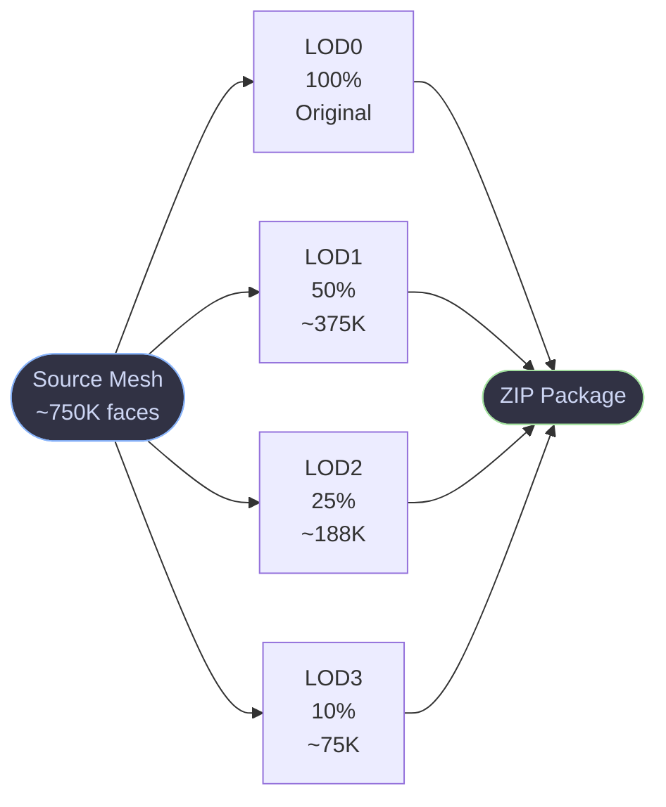
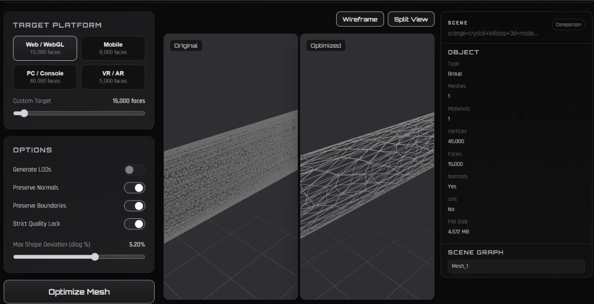
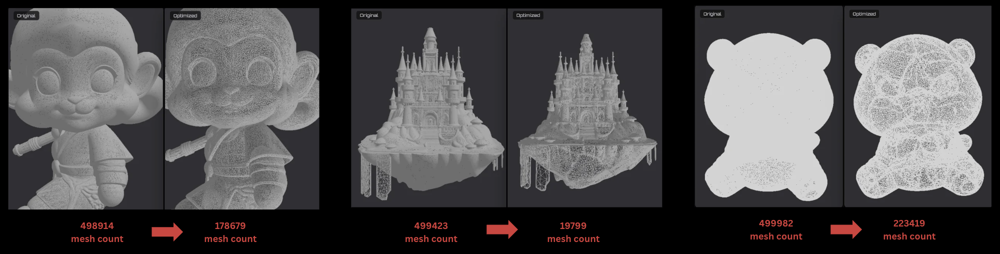
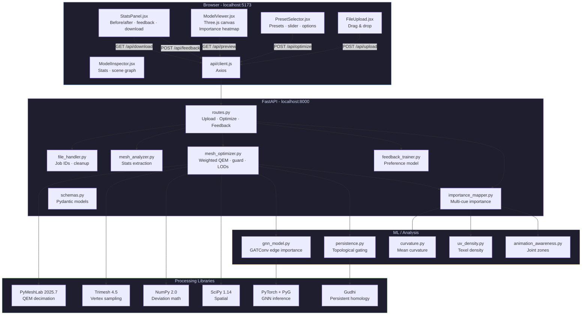
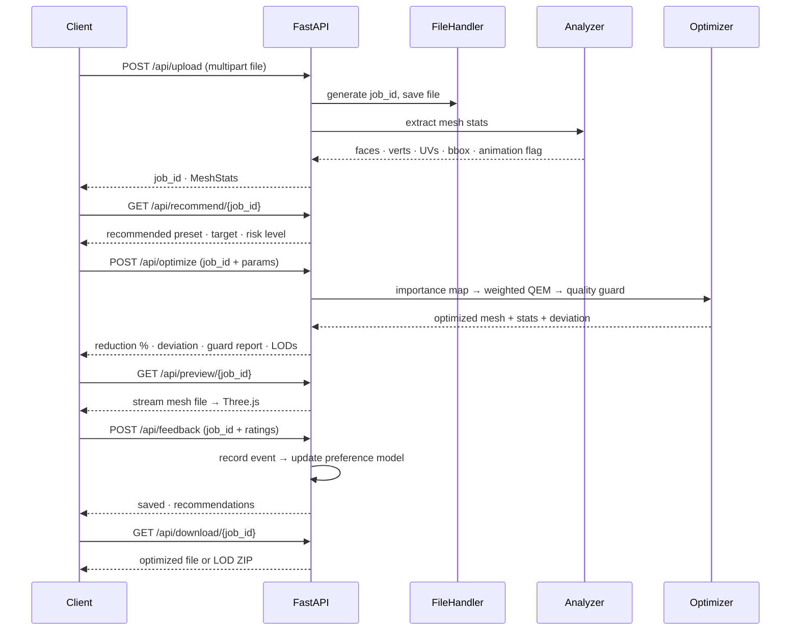

# Crunch3D

> Intelligent 3D mesh optimization. Not just smaller - smarter.

Crunch3D is a full-stack mesh optimization platform built for developers and 3D artists who need production-ready assets without the hours of manual retopology. AI-generated meshes from Tripo3D, Meshy, and Shap-E ship with 700K–800K+ polygons. They're beautiful. They're also completely unusable in real-time environments.

Crunch3D fixes that.

---

## The Problem

| Tool | What It Does | What It Misses |
|---|---|---|
| Traditional decimators | Reduce polygon count | Treat every triangle equally |
| Manual retopology | Full artist control | Takes hours, costs $300–500/mo in software |
| **Crunch3D** | **Intelligent reduction** | **Production readiness** |

Standard mesh optimization tools apply the same reduction uniformly across a mesh. A face gets the same priority as a fingertip. An empty background surface gets the same protection as a mechanical joint.

Crunch3D is designed around a different premise: **understand what matters before you optimize.**

---

## How It Works

Upload a mesh - Crunch3D analyzes it instantly: face count, vertex count, UVs, normals, bounding box, and animation skeleton presence. A multi-cue importance map (curvature, UV density, animation zones, and optionally GNN-predicted edge importance) guides the decimation to protect perceptually critical regions. Pick a platform preset or dial in a custom face target. The optimization engine runs importance-weighted QEM decimation with a **Quality Guard** retry loop, then checks surface deviation against your quality threshold. If the shape deviates too much, it retries at a less aggressive target automatically. Output is either a single optimized file or a full LOD package (4 levels), ready to download.

---

## Current Capabilities

### Mesh Upload & Analysis
- OBJ, STL, PLY, GLB, GLTF, FBX, OFF up to 50MB
- Instant face count, vertex count, and file size analysis
- UV presence, normals, bounding box, and animation skeleton detection
- Multi-component mesh handling - each connected component is decimated proportionally

### Intelligent Mesh Optimization
- **Importance-Weighted QEM** - curvature, UV density, animation zone, and GNN edge importance scores are folded into the quadric error cost function
- **Quality Guard** - samples up to 700 vertices pre-decimation, measures 95th-percentile surface deviation, and automatically relaxes the target face count if shape fidelity would break
- Boundary and normal preservation through decimation
- 6 configurable importance cues (curvature: fast/accurate modes, UV density, animation awareness, GNN edge importance)

### Semantic Importance Mapping
Surface curvature analysis (mean curvature via cotangent Laplacian) generates per-vertex importance scores. High-curvature regions - faces, fingers, mechanical edges - are assigned higher importance and preserved during decimation. Flat or low-curvature areas are simplified more aggressively.

The importance map is visualized in the 3D viewer as a color-coded heatmap overlay (red = high importance, blue = low importance).

### GNN Edge Importance Prediction
A **Graph Attention Network (GATConv)** predicts per-edge importance scores from local geometric features (dihedral angle, edge length, curvature, face normals). The GNN is trained on user feedback signals to align importance predictions with human perceptual priorities. The predicted scores modulate the QEM collapse cost.

### Persistent Homology Topological Gating
Using **Gudhi**, the system computes persistent homology of the lower-star filtration of the mesh. Edges with persistence below a configurable threshold $\tau_{topo}$ are deemed topologically admissible for collapse. This prevents the decimator from destroying important topological features during simplification.

### Animation-Aware Optimization
Joint/skeleton detection identifies deformation-critical regions (knees, elbows, shoulders, jaw, fingers). These zones are assigned higher importance, protecting them from aggressive simplification while stable geometry is reduced more freely.

### UV-Density-Aware Texture Preservation
UV density analysis identifies texel-dense regions. Faces with high UV density (fine texture detail) receive higher importance, preventing texture distortion and UV stretching during decimation.

### Platform Presets

| Preset | Target Faces | Use Case |
|---|---|---|
| Tiny UI Element | 8,000 | Icons, floating shapes |
| Decorative Background | 25,000 | Repeatable background models |
| Mobile Hero | 45,000 | Performance-priority mobile scenes |
| Hero Section | 70,000 | Single focus object |
| Interactive Model | 100,000 | Rotation / hover interactions |
| Multiple Models Scene | 220,000 | Total scene budget |

Or dial in any custom target with the face count slider.

### Automatic LOD Generation



One click. All four levels. Packaged as a ZIP.

### Interactive 3D Viewer
- Real-time Three.js viewer with orbit, zoom, and pan
- Wireframe mode for topology inspection
- **Importance Map heatmap overlay** - color-coded per-vertex importance
- Split view - original vs optimized, synchronized controls
- Model Inspector panel: scene graph, transform data, bounding box, camera info

### User Feedback & Preference Learning
After optimization, users can submit feedback: satisfaction rating, shape/vertex/face preservation flags, issue tags, and free-text notes. Feedback is recorded as training events, and a **preference model** is bootstrapped to learn per-profile optimization preferences. The model powers the **recommendation engine** that suggests presets and settings for future uploads.

### Recommendation Engine
Based on mesh characteristics (face count, file size) and learned preference profiles, the system recommends a preset, target face count, performance mode, and risk level for each uploaded mesh.

### Export Pipeline
- Single optimized mesh download
- Multi-LOD ZIP package
- Before/after stats: face count, vertex count, file size, reduction %, processing time
- Texture export with fallback handling

---

## Current MVP Screenshots

### Interactive Mesh Optimization Demo



### High-Poly vs Optimized Mesh Comparison



---

## Quality Guard - Deep Dive

Standard decimation tools hit a target face count blindly. The mesh either holds or it doesn't.

Crunch3D's quality guard works in steps:

1. Before decimation, samples up to 700 vertices from the original as a geometric reference
2. Runs QEM decimation at the requested target
3. Measures **surface deviation** - the 95th-percentile nearest-neighbor distance between original and decimated vertex clouds, normalized to the bounding box diagonal
4. If deviation exceeds `max_deviation_percent`, retries at progressively less aggressive targets across 6 candidate levels
5. Reports the exact target used, measured deviation, and whether the guard was triggered

Setting `max_deviation_percent: 2.0` guarantees the output mesh never deviates more than 2% from the original shape - even if that means keeping more polygons than requested.

---

## System Architecture



---

## API Reference



| Method | Endpoint | Description |
|---|---|---|
| `GET` | `/` | API info |
| `GET` | `/health` | Health check |
| `POST` | `/api/upload` | Upload mesh file, returns `job_id` + `MeshStats` |
| `GET` | `/api/recommend/{job_id}` | Get optimization recommendation (preset, target, risk) |
| `POST` | `/api/optimize` | Run weighted-QEM decimation + quality guard |
| `GET` | `/api/status/{job_id}` | Status: uploaded / processing / completed / failed |
| `GET` | `/api/preview/{job_id}` | Stream mesh for the Three.js viewer |
| `GET` | `/api/importance/{job_id}` | Get per-vertex importance scores |
| `POST` | `/api/feedback` | Submit user satisfaction feedback |
| `GET` | `/api/training/summary` | Training metrics: events, feedback ratio, top issues |
| `POST` | `/api/training/bootstrap` | Train / refresh preference model from logged events |
| `GET` | `/api/download/{job_id}` | Download optimized file or multi-LOD ZIP |
| `DELETE` | `/api/job/{job_id}` | Delete job and clean up temp files |

Interactive docs at **http://localhost:8000/docs** when the backend is running.

**Quick test:**
```bash
# Upload
curl -X POST http://localhost:8000/api/upload -F "file=@model.obj"

# Optimize
curl -X POST http://localhost:8000/api/optimize \
  -H "Content-Type: application/json" \
  -d '{
    "job_id": "YOUR_JOB_ID",
    "target_faces": 70000,
    "preset": "hero_standard",
    "generate_lods": false,
    "preserve_normals": true,
    "preserve_boundaries": true,
    "strict_quality": true,
    "max_deviation_percent": 2.0
  }'

# Download
curl -OJ http://localhost:8000/api/download/YOUR_JOB_ID
```

---

## Why Crunch3D?

Traditional mesh optimization stops at polygon reduction.

Crunch3D is being built toward **production readiness** - a complete understanding of what makes a mesh deployment-ready, not just lighter. The system combines:
- **Multi-cue importance** (curvature, UV density, animation zones, GNN predictions)
- **Topological guarantees** (persistent homology gating)
- **Quality assurance** (surface deviation retry loop)
- **Human-in-the-loop learning** (feedback → preference model → recommendations)

---

## Roadmap

**MVP - Today**
Mesh upload & analysis, importance-weighted QEM decimation with 6 importance cues, Quality Guard, 4-level LOD generation, Three.js viewer with heatmap overlay, animation-aware optimization, UV-density preservation, user feedback loop, preference model training, optimization recommendation engine, model inspector, export pipeline.

**v1.1 - Near Term**
Interactive heatmap refinement (paint importance directly on mesh), texture reallocation for UV distortion correction.

**v1.2 - Mid Term**
Production Readiness Scoring with platform-specific deploy scores (Visual Fidelity, Animation Readiness, Texture Preservation, Web Deploy Score). Weighted QEM with full importance map integration in the cost function.

**v2.0 - Longer Term**
Async job queue (Celery + Redis), persistent job storage (PostgreSQL), multi-user accounts, team workspaces, batch processing, API-first mode for CI/CD pipelines, real-time collaboration on optimization profiles.

---

## Tech Stack

| Layer | Technology |
|---|---|
| Frontend | React 18, Vite, Three.js, @react-three/fiber, @react-three/drei |
| Styling | Tailwind CSS + CSS custom properties (dark/light themes) |
| Backend | FastAPI (Python 3.11), Uvicorn |
| Mesh Processing | PyMeshLab 2025.7, Trimesh 4.5, NumPy 2.0, SciPy 1.14 |
| ML / DL | PyTorch, PyTorch Geometric (GATConv), Gudhi (persistent homology) |
| HTTP | Axios |
| Package Manager | pnpm |

```mermaid
graph LR
    subgraph FE["Frontend"]
        R18[React 18] --- Vite
        Vite --- TJS[Three.js]
        TJS --- RTF[@react-three/fiber]
        Vite --- TW[Tailwind CSS]
    end
    subgraph BE["Backend"]
        FAPI[FastAPI] --- UV[Uvicorn]
        UV --- PY[Python 3.11]
    end
    subgraph PROC["Mesh Processing"]
        PML2[PyMeshLab 2025.7]
        TM2[Trimesh 4.5]
        NP2[NumPy 2.0]
        SC2[SciPy 1.14]
    end
    subgraph ML["ML / TDA"]
        TCH[PyTorch + PyG]
        GUD[Gudhi]
    end
    FE -->|Axios /api/*| BE
    BE --> PROC
    BE --> ML

    style FE fill:#1e1e2e,color:#cdd6f4,stroke:#89b4fa
    style BE fill:#1e1e2e,color:#cdd6f4,stroke:#cba6f7
    style PROC fill:#1e1e2e,color:#cdd6f4,stroke:#a6e3a1
    style ML fill:#1e1e2e,color:#cdd6f4,stroke:#f9e2af
```

---

## Project Structure

```
crunch3d/
├── .env.example              # Environment template
├── .gitignore
├── Dockerfile                # Root Dockerfile
├── README.md
├── plan.md                   # V2 redesign & architecture plan
├── crunch3d-v2.tex           # Academic paper (LaTeX)
│
├── model/                    # Python backend
│   ├── main.py               # FastAPI entry, CORS
│   ├── requirements.txt      # Python deps
│   ├── Dockerfile
│   │
│   ├── api/
│   │   ├── routes.py         # All API endpoints
│   │   └── schemas.py        # Pydantic models
│   │
│   ├── core/
│   │   └── config.py         # Hyperparameters, feature flags
│   │
│   ├── engine/
│   │   └── mesh_optimizer.py # Weighted QEM, LOD generation, quality guard
│   │
│   ├── importance/
│   │   ├── importance_mapper.py  # Multi-cue importance computation
│   │   ├── curvature.py          # Fast/accurate curvature modes
│   │   ├── uv_density.py         # UV-density texture importance
│   │   └── animation_awareness.py # Skeletal/joint importance
│   │
│   ├── services/
│   │   ├── file_handler.py    # Job management, upload/processed dirs
│   │   ├── mesh_analyzer.py   # Stats extraction
│   │   └── feedback_trainer.py # Feedback recording, preference model
│   │
│   ├── learning/
│   │   ├── gnn_model.py       # GATConv edge importance
│   │   ├── inference.py       # GNN inference at decimation
│   │   ├── dataset.py         # PyG dataset construction
│   │   ├── trainer.py         # Training loop scaffold
│   │   └── checkpoints/       # Model weights
│   │
│   ├── topology/
│   │   ├── persistence.py     # Persistent homology (Gudhi)
│   │   ├── gate.py            # Admissibility gate
│   │   └── filtration.py      # Lower-star filtration
│   │
│   ├── texture/
│   │   └── reallocation.py   # Texel density reallocation
│   │
│   ├── uploads/               # Per-job uploads
│   ├── processed/             # Per-job output
│   └── training/              # Feedback logs, preference model
│
└── web/                       # React frontend
    ├── index.html
    ├── package.json
    ├── pnpm-lock.yaml
    ├── pnpm-workspace.yaml
    ├── vite.config.js         # Dev server + /api proxy -> :8000
    ├── tailwind.config.js     # Brand colors
    ├── postcss.config.js
    ├── .env
    │
    ├── assets/                # Static assets (screenshots)
    │
    └── src/
        ├── main.jsx           # Entry point
        ├── App.jsx            # Root routing (landing vs demo)
        ├── DemoApp.jsx        # Central state management
        ├── index.css          # Design system, dark/light themes
        ├── api/
        │   └── client.js     # Axios client for all endpoints
        ├── components/
        │   ├── FileUpload.jsx       # Drag & drop zone
        │   ├── ModelViewer.jsx      # Three.js canvas, split view, heatmap
        │   ├── ModelInspector.jsx   # Scene graph, transform, camera info
        │   ├── PresetSelector.jsx   # Platform presets, face slider, options
        │   └── StatsPanel.jsx       # Before/after stats, LODs, feedback, download
        └── landing/
            ├── Layout.jsx          # Landing page layout
            ├── LandingPage.jsx     # Marketing page
            └── components/
                ├── Navbar.jsx
                ├── HeroSection.jsx
                ├── FeatureCards.jsx
                ├── AboutSection.jsx
                └── SupportedPlatforms.jsx
```

---

## Prerequisites

| Tool | Version | Check |
|---|---|---|
| Python | 3.11 (not 3.12+) | `python --version` |
| Node.js | 18+ | `node --version` |
| pnpm | 8+ | `pnpm --version` |

> PyMeshLab only supports Python 3.11 and below. Python 3.12 will fail at install.

On Linux, install OpenGL system libs first:
```bash
sudo apt-get install libgl1-mesa-glx libglib2.0-0
```

---

## Setup

### 1. Clone

```bash
git clone https://github.com/your-username/crunch3d.git
cd crunch3d
```

### 2. Backend

```bash
cd model
python -m venv venv
source venv/bin/activate        # Windows: venv\Scripts\activate
pip install -r requirements.txt
```

`requirements.txt` includes optional ML dependencies (`torch`, `torch-geometric`, `gudhi`). If not available, the system degrades gracefully - importance mapping falls back to curvature-only, and topological gating is skipped.

### 3. Frontend

```bash
cd ../web
pnpm install
```

### 4. Environment

```bash
cp .env.example .env
```

Default `.env.example` values work for local development with no changes:

```env
BACKEND_PORT=8000
MAX_FILE_SIZE_MB=50
CORS_ORIGINS=http://localhost:5173,http://localhost:3000
CORS_ORIGIN_REGEX=https://.*\.vercel\.app
VITE_API_BASE_URL=http://localhost:8000
```

No API keys required.

---

## Running

Open two terminals.

**Terminal 1 - Model Server**
```bash
source model/venv/bin/activate
uvicorn model.main:app --reload --port 8000
```

**Terminal 2 - Web Client**
```bash
cd web
pnpm run dev
```

Open **http://localhost:5173**

The Vite dev server proxies all `/api/*` calls to port 8000 automatically.

---

## Known Limitations

- **Output format** - GLB/GLTF and FBX inputs are processed but saved as OBJ (PyMeshLab constraint)
- **Rigged meshes** - Skinned/animated meshes with bone weights are not supported. Static meshes only. Animation *zones* are detected but skinning is not preserved.
- **Job persistence** - Jobs are stored in memory with filesystem fallback. Restarting the backend clears in-memory state.
- **Concurrency** - No async job queue (planned for v2.0). Large meshes block during decimation.
- **GNN training** - The training loop is a scaffold and requires a dataset of user feedback events to produce meaningful model weights.