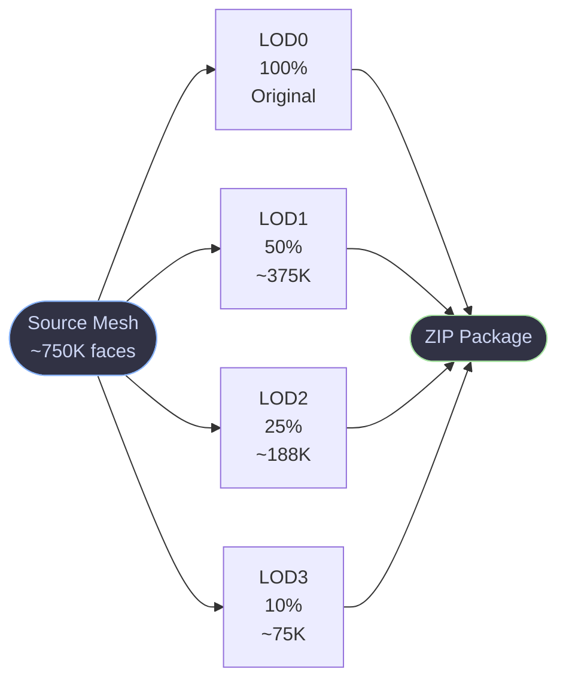
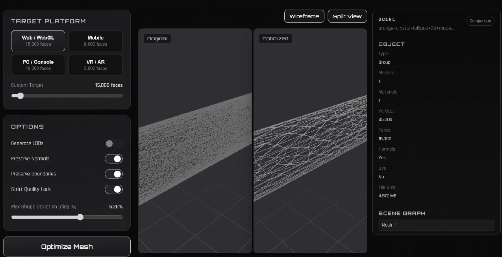
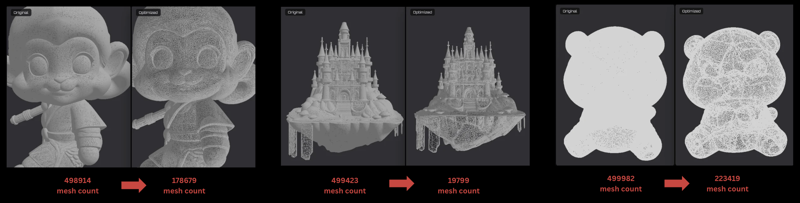
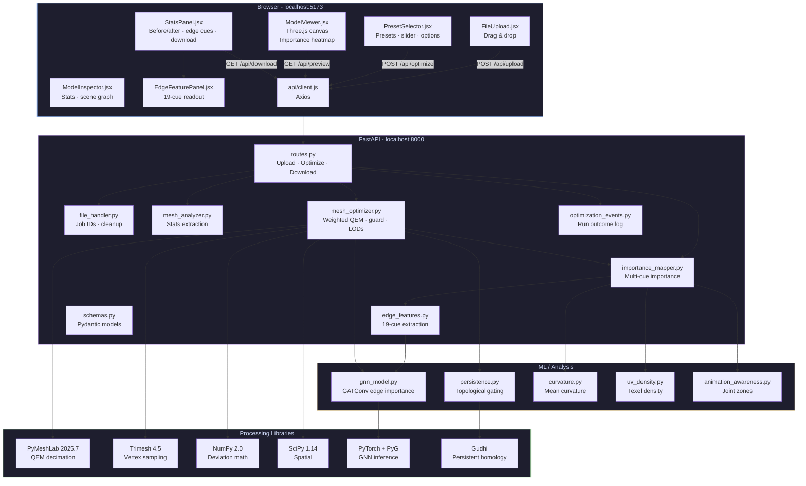
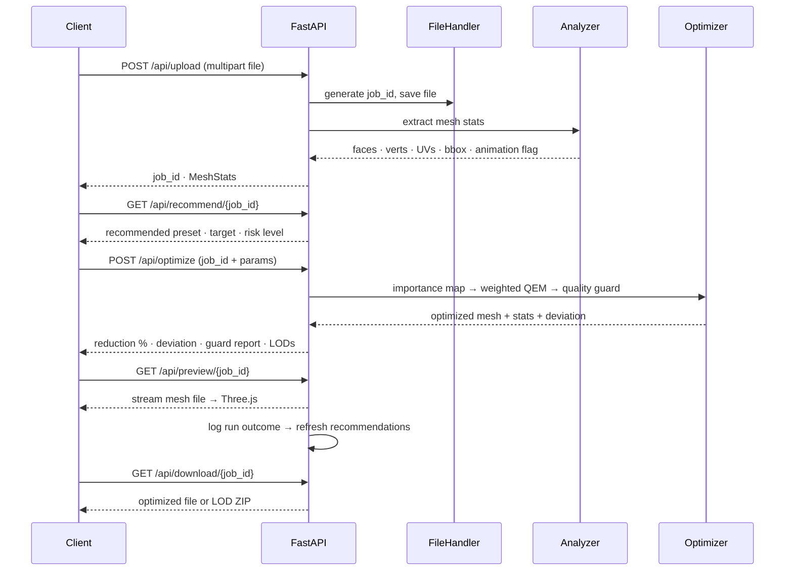

# Crunch3D

> Intelligent 3D mesh optimization. Not just smaller - smarter.

Crunch3D is a full-stack mesh optimization platform built for developers and 3D artists who need production-ready assets without the hours of manual retopology. AI-generated meshes from Tripo3D, Meshy, and Shap-E ship with 700K–800K+ polygons. They're beautiful. They're also completely unusable in real-time environments.

Crunch3D fixes that.

---

## The Problem

| Tool | What It Does | What It Misses |
|---|---|---|
| Traditional decimators | Reduce polygon count | Treat every triangle equally |
| Manual retopology | Full artist control | Takes hours, costs $300–500/mo in software |
| **Crunch3D** | **Intelligent reduction** | **Production readiness** |

Standard mesh optimization tools apply the same reduction uniformly across a mesh. A face gets the same priority as a fingertip. An empty background surface gets the same protection as a mechanical joint.

Crunch3D is designed around a different premise: **understand what matters before you optimize.**

---

## How It Works

Upload a mesh - Crunch3D analyzes it instantly: face count, vertex count, UVs, normals, bounding box, and animation skeleton presence. A multi-cue importance map (curvature, UV density, animation zones, and optionally GNN-predicted edge importance) guides the decimation to protect perceptually critical regions. Pick a platform preset or dial in a custom face target. The optimization engine runs importance-weighted QEM decimation with a **Quality Guard** retry loop, then checks surface deviation against your quality threshold. If the shape deviates too much, it retries at a less aggressive target automatically. Output is either a single optimized file or a full LOD package (4 levels), ready to download.

---

## Current Capabilities

### Mesh Upload & Analysis
- OBJ, STL, PLY, GLB, GLTF, FBX, OFF up to 50MB
- Instant face count, vertex count, and file size analysis
- UV presence, normals, bounding box, and animation skeleton detection
- Multi-component mesh handling - each connected component is decimated proportionally

### Intelligent Mesh Optimization
- **Importance-Weighted QEM** - curvature, UV density, animation zone, and GNN edge importance scores are folded into the quadric error cost function
- **Quality Guard** - samples up to 700 vertices pre-decimation, measures 95th-percentile surface deviation, and automatically relaxes the target face count if shape fidelity would break
- Boundary and normal preservation through decimation
- 6 configurable importance cues (curvature: fast/accurate modes, UV density, animation awareness, GNN edge importance)

### Semantic Importance Mapping
Surface curvature analysis (mean curvature via cotangent Laplacian) generates per-vertex importance scores. High-curvature regions - faces, fingers, mechanical edges - are assigned higher importance and preserved during decimation. Flat or low-curvature areas are simplified more aggressively.

The importance map is visualized in the 3D viewer as a color-coded heatmap overlay (red = high importance, blue = low importance).

### GNN Edge Importance Prediction
A **Graph Attention Network (GATConv)** predicts per-edge importance scores from a 7-cue vertex feature vector (mean/Gaussian curvature, dihedral angle, valence, boundary flag, UV stretch and a colour/texture retention cue). The GNN is trained self-supervised against geometric error targets, so no human labelling is required. The predicted scores modulate the QEM collapse cost.

### Self-Learning AI (learns from every optimization)
The GNN does not sit still. Every completed optimization captures a downsampled graph sample of the mesh it just processed (with the colour/texture cues and the importance decisions the run actually used), and a background task periodically fine-tunes the model on the accumulated dataset — **the AI keeps learning on its own by doing the job**. On top of real runs, a procedural dataset generator bootstraps the model with hundreds of randomized primitives (noise-warped surfaces + baked vertex colours) so training starts from a large, varied dataset. See `GET /api/learning/status`.

### Upload & Result Storage on Cloudflare R2
Meshes, optimized outputs and per-job metadata are stored in an **S3-compatible object bucket** — Cloudflare R2 recommended ($0 egress on downloads, S3 API, 10 GB free tier). Any S3-compatible provider (AWS S3, MinIO, Backblaze B2) works by just changing the endpoint.

With `STORAGE_BACKEND=cloud` the bucket is the **authoritative store**:
- raw uploads, every optimized output and LOD, and per-job metadata are **required** to land in the bucket (the API fails with 500 instead of silently degrading),
- **all previews and downloads stream from the bucket** — never from the container's disk,
- the local filesystem is only an ephemeral working cache for the mesh engine (it can be wiped at any time; jobs survive restarts and re-optimization re-pulls inputs from the bucket),
- missing bucket credentials fail fast at startup with a clear error.

`STORAGE_BACKEND=local` keeps the pure-local behavior for development.

### Daily Download Quota
Users may optimize as many times as they want, but each client can download at most **5 optimized results per rolling 24h** (configurable via `MAX_DOWNLOADS_PER_DAY`). The quota is anonymous-device based (`X-Client-Id` header) with IP fallback, persisted in SQLite, and surfaced in the UI as "X of 5 downloads left today".

### 19-Cue Edge Feature Extraction
Every candidate edge is described by a fixed-length, fixed-order feature vector computed in `importance/edge_features.py`. The cues span geometry, appearance, rigging and view-dependence:

| # | Cue | What it captures |
|---|-----|------------------|
| 1 | Edge Length | Normalized length; short edges collapse cheaply |
| 2 | Curvature | Local principal-curvature magnitude |
| 3 | Mean Curvature | Average of principal curvatures (H) |
| 4 | Gaussian Curvature | Product of principal curvatures (K) |
| 5 | Dihedral Angle | Fold angle between the two adjacent faces |
| 6 | Surface Normal Difference | Normal divergence across the edge |
| 7 | Material Boundary | Edge separates two material groups |
| 8 | UV Seam | Edge lies on a texture-coordinate discontinuity |
| 9 | Bone Weight Difference | Skin-weight divergence across the edge |
| 10 | Texture Gradient | Local texel-space intensity gradient |
| 11 | Ambient Occlusion | Local occlusion / crevice darkening |
| 12 | Vertex Color Difference | Baked vertex-colour discontinuity |
| 13 | Sharp Edge Flag | Dihedral angle above the sharp threshold |
| 14 | Boundary Edge Flag | Edge borders a hole (single adjacent face) |
| 15 | Surface Area Contribution | Share of total surface area the edge supports |
| 16 | Screen-space Importance | Projected size under the reference camera |
| 17 | Visibility Score | How often the edge is visible from outside |
| 18 | Silhouette Score | Likelihood of sitting on an outline |
| 19 | Animation Influence | Overlap with detected deformation zones |

Cues that need data a mesh does not carry (no UVs, no skin weights, no vertex colours) degrade to a neutral value rather than failing, so the vector is always well-formed. Features are cached per mesh and reused by the importance mapper, the GNN and the API summary.

### Persistent Homology Topological Gating
Using **Gudhi**, the system computes persistent homology of the lower-star filtration of the mesh. Edges with persistence below a configurable threshold $\tau_{topo}$ are deemed topologically admissible for collapse. This prevents the decimator from destroying important topological features during simplification.

### Animation-Aware Optimization
Joint/skeleton detection identifies deformation-critical regions (knees, elbows, shoulders, jaw, fingers). These zones are assigned higher importance, protecting them from aggressive simplification while stable geometry is reduced more freely.

### UV-Density-Aware Texture Preservation
UV density analysis identifies texel-dense regions. Faces with high UV density (fine texture detail) receive higher importance, preventing texture distortion and UV stretching during decimation.

### Platform Presets

| Preset | Target Faces | Use Case |
|---|---|---|
| Tiny UI Element | 8,000 | Icons, floating shapes |
| Decorative Background | 25,000 | Repeatable background models |
| Mobile Hero | 45,000 | Performance-priority mobile scenes |
| Hero Section | 70,000 | Single focus object |
| Interactive Model | 100,000 | Rotation / hover interactions |
| Multiple Models Scene | 220,000 | Total scene budget |

Or dial in any custom target with the face count slider.

### Automatic LOD Generation


```mermaid
graph LR
    SRC([Source Mesh\n~750K faces]) --> L0[LOD0\n100%\nOriginal]
    SRC --> L1[LOD1\n50%\n~375K]
    SRC --> L2[LOD2\n25%\n~188K]
    SRC --> L3[LOD3\n10%\n~75K]
    L0 & L1 & L2 & L3 --> ZIP([ZIP Package])

    style SRC fill:#313244,color:#cdd6f4,stroke:#89b4fa
    style ZIP fill:#313244,color:#cdd6f4,stroke:#a6e3a1
```

One click. All four levels. Packaged as a ZIP.

### Interactive 3D Viewer
- Real-time Three.js viewer with orbit, zoom, and pan
- Wireframe mode for topology inspection
- **Importance Map heatmap overlay** - color-coded per-vertex importance
- Split view - original vs optimized, synchronized controls
- Model Inspector panel: scene graph, transform data, bounding box, camera info

### Optimization Event Logging
Every completed optimization is recorded as a training event with its measured outcome: face reduction, surface deviation, quality-guard retries and timings. These events are derived from the run itself, so the log builds automatically without any user input.

### Recommendation Engine
Based on mesh characteristics (face count, file size) and the logged outcomes of previous runs, the system recommends a preset, target face count, performance mode, and risk level for each uploaded mesh.

### Export Pipeline
- Single optimized mesh download
- Multi-LOD ZIP package
- Before/after stats: face count, vertex count, file size, reduction %, processing time
- Texture export with fallback handling

---

## Current MVP Screenshots

### Interactive Mesh Optimization Demo



### High-Poly vs Optimized Mesh Comparison



---

## Quality Guard - Deep Dive

Standard decimation tools hit a target face count blindly. The mesh either holds or it doesn't.

Crunch3D's quality guard works in steps:

1. Before decimation, samples up to 700 vertices from the original as a geometric reference
2. Runs QEM decimation at the requested target
3. Measures **surface deviation** - the 95th-percentile nearest-neighbor distance between original and decimated vertex clouds, normalized to the bounding box diagonal
4. If deviation exceeds `max_deviation_percent`, retries at progressively less aggressive targets across 6 candidate levels
5. Reports the exact target used, measured deviation, and whether the guard was triggered

Setting `max_deviation_percent: 2.0` guarantees the output mesh never deviates more than 2% from the original shape - even if that means keeping more polygons than requested.

---

## System Architecture


```mermaid
graph TB
    subgraph Browser["Browser - localhost:5173"]
        FU[FileUpload.jsx\nDrag & drop]
        MV[ModelViewer.jsx\nThree.js canvas\nImportance heatmap]
        MI[ModelInspector.jsx\nStats · scene graph]
        PS[PresetSelector.jsx\nPresets · slider · options]
        SP[StatsPanel.jsx\nBefore/after · edge cues · download]
        EF[EdgeFeaturePanel.jsx\n19-cue readout]
        API[api/client.js\nAxios]
    end

    subgraph Backend["FastAPI - localhost:8000"]
        R[routes.py\nUpload · Optimize · Download]
        FH[file_handler.py\nJob IDs · cleanup]
        MA[mesh_analyzer.py\nStats extraction]
        MO[mesh_optimizer.py\nWeighted QEM · guard · LODs]
        OE[optimization_events.py\nRun outcome log]
        EFX[edge_features.py\n19-cue extraction]
        IM[importance_mapper.py\nMulti-cue importance]
        SCH[schemas.py\nPydantic models]
    end

    subgraph ML["ML / Analysis"]
        GNN[gnn_model.py\nGATConv edge importance]
        PERS[persistence.py\nTopological gating]
        CURV[curvature.py\nMean curvature]
        UV[uv_density.py\nTexel density]
        ANIM[animation_awareness.py\nJoint zones]
    end

    subgraph Libs["Processing Libraries"]
        PML[PyMeshLab 2025.7\nQEM decimation]
        TM[Trimesh 4.5\nVertex sampling]
        NP[NumPy 2.0\nDeviation math]
        SC[SciPy 1.14\nSpatial]
        TCH[PyTorch + PyG\nGNN inference]
        GUD[Gudhi\nPersistent homology]
    end

    FU -->|POST /api/upload| API
    PS -->|POST /api/optimize| API
    MV -->|GET /api/preview| API
    SP -->|GET /api/download| API
    SP --> EF

    API --> R
    R --> FH
    R --> MA
    R --> MO
    R --> OE
    R --> IM
    MO --> PML & TM & NP & SC
    MO --> IM
    IM --> CURV & UV & ANIM
    IM --> EFX
    EFX --> GNN
    MO --> GNN
    MO --> PERS
    GNN --> TCH
    PERS --> GUD

    style Browser fill:#1e1e2e,color:#cdd6f4,stroke:#89b4fa
    style Backend fill:#1e1e2e,color:#cdd6f4,stroke:#cba6f7
    style ML fill:#1e1e2e,color:#cdd6f4,stroke:#f9e2af
    style Libs fill:#1e1e2e,color:#cdd6f4,stroke:#a6e3a1
```

---

## API Reference


```mermaid
sequenceDiagram
    participant Client
    participant FastAPI
    participant FileHandler
    participant Analyzer
    participant Optimizer

    Client->>FastAPI: POST /api/upload (multipart file)
    FastAPI->>FileHandler: generate job_id, save file
    FastAPI->>Analyzer: extract mesh stats
    Analyzer-->>FastAPI: faces · verts · UVs · bbox · animation flag
    FastAPI-->>Client: job_id · MeshStats

    Client->>FastAPI: GET /api/recommend/{job_id}
    FastAPI-->>Client: recommended preset · target · risk level

    Client->>FastAPI: POST /api/optimize (job_id + params)
    FastAPI->>Optimizer: importance map → weighted QEM → quality guard
    Optimizer-->>FastAPI: optimized mesh + stats + deviation
    FastAPI-->>Client: reduction % · deviation · guard report · LODs

    Client->>FastAPI: GET /api/preview/{job_id}
    FastAPI-->>Client: stream mesh file → Three.js

    FastAPI->>FastAPI: log run outcome → refresh recommendations

    Client->>FastAPI: GET /api/download/{job_id}
    FastAPI-->>Client: optimized file or LOD ZIP
```

| Method | Endpoint | Description |
|---|---|---|
| `GET` | `/` | API info |
| `GET` | `/health` | Health check |
| `POST` | `/api/upload` | Upload mesh file, returns `job_id` + `MeshStats` |
| `GET` | `/api/recommend/{job_id}` | Get optimization recommendation (preset, target, risk) |
| `POST` | `/api/optimize` | Run weighted-QEM decimation + quality guard; response includes the 19-cue `edge_features` summary |
| `GET` | `/api/status/{job_id}` | Status: uploaded / processing / completed / failed |
| `GET` | `/api/preview/{job_id}` | Stream mesh for the Three.js viewer |
| `GET` | `/api/importance/{job_id}` | Get per-vertex importance scores |
| `GET` | `/api/download/{job_id}` | Download optimized file or multi-LOD ZIP (5 downloads/24h/client) |
| `GET` | `/api/download/quota` | Remaining daily downloads for the calling client |
| `GET` | `/api/learning/status` | Self-learning AI snapshot: dataset size, last retrain, checkpoint |
| `POST` | `/api/learning/retrain` | Manually trigger one GNN fine-tuning pass |
| `DELETE` | `/api/job/{job_id}` | Delete job and clean up temp files |

Interactive docs at **http://localhost:8000/docs** when the backend is running.

**Quick test:**
```bash
# Upload
curl -X POST http://localhost:8000/api/upload -F "file=@model.obj"

# Optimize
curl -X POST http://localhost:8000/api/optimize \
  -H "Content-Type: application/json" \
  -d '{
    "job_id": "YOUR_JOB_ID",
    "target_faces": 70000,
    "preset": "hero_standard",
    "generate_lods": false,
    "preserve_normals": true,
    "preserve_boundaries": true,
    "strict_quality": true,
    "max_deviation_percent": 2.0
  }'

# Download
curl -OJ http://localhost:8000/api/download/YOUR_JOB_ID
```

---

## Why Crunch3D?

Traditional mesh optimization stops at polygon reduction.

Crunch3D is being built toward **production readiness** - a complete understanding of what makes a mesh deployment-ready, not just lighter. The system combines:
- **Multi-cue importance** (curvature, UV density, animation zones, GNN predictions)
- **Topological guarantees** (persistent homology gating)
- **Quality assurance** (surface deviation retry loop)
- **Self-supervised learning** (logged run outcomes → recommendations, no labelling step)

---

## Roadmap

**MVP - Today**
Mesh upload & analysis, importance-weighted QEM decimation with 6 importance cues, 19-cue edge feature extraction, Quality Guard, 4-level LOD generation, Three.js viewer with heatmap overlay, animation-aware optimization, UV-density preservation, optimization event logging, recommendation engine, model inspector, export pipeline.

**v1.1 - Near Term**
Interactive heatmap refinement (paint importance directly on mesh), texture reallocation for UV distortion correction.

**v1.2 - Mid Term**
Production Readiness Scoring with platform-specific deploy scores (Visual Fidelity, Animation Readiness, Texture Preservation, Web Deploy Score). Weighted QEM with full importance map integration in the cost function.

**v2.0 - Longer Term**
Async job queue (Celery + Redis), persistent job storage (PostgreSQL), multi-user accounts, team workspaces, batch processing, API-first mode for CI/CD pipelines, real-time collaboration on optimization profiles.

---

## Tech Stack

| Layer | Technology |
|---|---|
| Frontend | React 18, Vite, Three.js, @react-three/fiber, @react-three/drei |
| Styling | Tailwind CSS + CSS custom properties (dark/light themes) |
| Backend | FastAPI (Python 3.11), Uvicorn |
| Mesh Processing | PyMeshLab 2025.7, Trimesh 4.5, NumPy 2.0, SciPy 1.14 |
| ML / DL | PyTorch, PyTorch Geometric (GATConv), Gudhi (persistent homology) |
| HTTP | Axios |
| Package Manager | pnpm |

```mermaid
graph LR
    subgraph FE["Frontend"]
        R18[React 18] --- Vite
        Vite --- TJS[Three.js]
        TJS --- RTF[@react-three/fiber]
        Vite --- TW[Tailwind CSS]
    end
    subgraph BE["Backend"]
        FAPI[FastAPI] --- UV[Uvicorn]
        UV --- PY[Python 3.11]
    end
    subgraph PROC["Mesh Processing"]
        PML2[PyMeshLab 2025.7]
        TM2[Trimesh 4.5]
        NP2[NumPy 2.0]
        SC2[SciPy 1.14]
    end
    subgraph ML["ML / TDA"]
        TCH[PyTorch + PyG]
        GUD[Gudhi]
    end
    FE -->|Axios /api/*| BE
    BE --> PROC
    BE --> ML

    style FE fill:#1e1e2e,color:#cdd6f4,stroke:#89b4fa
    style BE fill:#1e1e2e,color:#cdd6f4,stroke:#cba6f7
    style PROC fill:#1e1e2e,color:#cdd6f4,stroke:#a6e3a1
    style ML fill:#1e1e2e,color:#cdd6f4,stroke:#f9e2af
```

---

## Project Structure

```
crunch3d/
├── .env.example              # Environment template
├── .gitignore
├── Dockerfile                # Root Dockerfile
├── README.md
├── plan.md                   # V2 redesign & architecture plan
├── crunch3d-v2.tex           # Academic paper (LaTeX)
│
├── model/                    # Python backend
│   ├── main.py               # FastAPI entry, CORS
│   ├── requirements.txt      # Python deps
│   ├── Dockerfile
│   │
│   ├── api/
│   │   ├── routes.py         # All API endpoints
│   │   └── schemas.py        # Pydantic models
│   │
│   ├── core/
│   │   └── config.py         # Hyperparameters, feature flags
│   │
│   ├── engine/
│   │   └── mesh_optimizer.py # Weighted QEM, LOD generation, quality guard
│   │
│   ├── importance/
│   │   ├── importance_mapper.py  # Multi-cue importance computation
│   │   ├── curvature.py          # Fast/accurate curvature modes
│   │   ├── uv_density.py         # UV-density texture importance
│   │   └── animation_awareness.py # Skeletal/joint importance
│   │
│   ├── services/
│   │   ├── file_handler.py    # Job management, upload/processed dirs
│   │   ├── mesh_analyzer.py   # Stats extraction
│   │   └── optimization_events.py # Run outcome logging, recommendations
│   │
│   ├── learning/
│   │   ├── gnn_model.py       # GATConv edge importance
│   │   ├── inference.py       # GNN inference at decimation
│   │   ├── dataset.py         # PyG dataset construction
│   │   ├── trainer.py         # Training loop scaffold
│   │   └── checkpoints/       # Model weights
│   │
│   ├── topology/
│   │   ├── persistence.py     # Persistent homology (Gudhi)
│   │   ├── gate.py            # Admissibility gate
│   │   └── filtration.py      # Lower-star filtration
│   │
│   ├── texture/
│   │   └── reallocation.py   # Texel density reallocation
│   │
│   ├── uploads/               # Per-job uploads
│   ├── processed/             # Per-job output
│   └── training/              # Optimization event log
│
└── web/                       # React frontend
    ├── index.html
    ├── package.json
    ├── pnpm-lock.yaml
    ├── pnpm-workspace.yaml
    ├── vite.config.js         # Dev server + /api proxy -> :8000
    ├── tailwind.config.js     # Brand colors
    ├── postcss.config.js
    ├── .env
    │
    ├── assets/                # Static assets (screenshots)
    │
    └── src/
        ├── main.jsx           # Entry point
        ├── App.jsx            # Root routing (landing vs demo)
        ├── DemoApp.jsx        # Central state management
        ├── index.css          # Design system, dark/light themes
        ├── api/
        │   └── client.js     # Axios client for all endpoints
        ├── components/
        │   ├── FileUpload.jsx       # Drag & drop zone
        │   ├── ModelViewer.jsx      # Three.js canvas, split view, heatmap
        │   ├── ModelInspector.jsx   # Scene graph, transform, camera info
        │   ├── PresetSelector.jsx   # Platform presets, face slider, options
        │   ├── EdgeFeaturePanel.jsx # 19-cue edge feature readout
        │   └── StatsPanel.jsx       # Before/after stats, LODs, edge cues, download
        └── landing/
            ├── Layout.jsx          # Landing page layout
            ├── LandingPage.jsx     # Marketing page
            └── components/
                ├── Navbar.jsx
                ├── HeroSection.jsx
                ├── FeatureCards.jsx
                ├── AboutSection.jsx
                └── SupportedPlatforms.jsx
```

---

## Prerequisites

| Tool | Version | Check |
|---|---|---|
| Python | 3.11 (not 3.12+) | `python --version` |
| Node.js | 18+ | `node --version` |
| pnpm | 8+ | `pnpm --version` |

> PyMeshLab only supports Python 3.11 and below. Python 3.12 will fail at install.

On Linux, install OpenGL system libs first:
```bash
sudo apt-get install libgl1-mesa-glx libglib2.0-0
```

---

## Setup

### 1. Clone

```bash
git clone https://github.com/your-username/crunch3d.git
cd crunch3d
```

### 2. Backend

```bash
cd model
python -m venv venv
source venv/bin/activate        # Windows: venv\Scripts\activate
pip install -r requirements.txt
```

`requirements.txt` includes optional ML dependencies (`torch`, `torch-geometric`, `gudhi`). If not available, the system degrades gracefully - importance mapping falls back to curvature-only, and topological gating is skipped.

### 3. Frontend

```bash
cd ../web
pnpm install
```

### 4. Environment

```bash
cp .env.example .env
```

Default `.env.example` values work for local development with no changes:

```env
BACKEND_PORT=8000
MAX_FILE_SIZE_MB=50
CORS_ORIGINS=http://localhost:5173,http://localhost:3000
CORS_ORIGIN_REGEX=https://.*\.vercel\.app
VITE_API_BASE_URL=http://localhost:8000
```

**Cloud storage (optional):** set `STORAGE_BACKEND=cloud` and fill in the
`CLOUD_STORAGE_*` vars. With Cloudflare R2: create a bucket, create an R2
API token, and use `https://<ACCOUNT_ID>.r2.cloudflarestorage.com` as the
endpoint. With `STORAGE_BACKEND=local` (default) everything stays on disk.

**Daily download quota (optional):** `MAX_DOWNLOADS_PER_DAY=5` caps
downloads per client per rolling 24h (optimizations are unlimited).

**Self-learning AI (optional):** `LEARNING_AUTO_RETRAIN=true` enables the
background dataset capture + retrain loop; `SEED_DATASET_COUNT=800` controls
the procedurally generated training dataset size. Disable for a
dependency-light deployment (torch/torch-geometric are optional anyway).

No API keys are required for the local default configuration.

---

## Running

Open two terminals.

**Terminal 1 - Model Server**
```bash
source model/venv/bin/activate
uvicorn model.main:app --reload --port 8000
```

**Terminal 2 - Web Client**
```bash
cd web
pnpm run dev
```

Open **http://localhost:5173**

The Vite dev server proxies all `/api/*` calls to port 8000 automatically.

---

## Known Limitations

- **Output format** - GLB/GLTF and FBX inputs are processed but saved as OBJ (PyMeshLab constraint)
- **Rigged meshes** - Skinned/animated meshes with bone weights are not supported. Static meshes only. Animation *zones* are detected but skinning is not preserved.
- **Job persistence** - Jobs are stored in memory with filesystem fallback. Restarting the backend clears in-memory state (durable copies live in the object bucket when cloud storage is enabled).
- **Concurrency** - No async job queue (planned for v2.0). Large meshes block during decimation.
- **GNN training** - The model fine-tunes continuously from captured optimization runs plus the procedural seed dataset; quality scales with how many meshes have been processed.
- **Texture preservation** - UV coordinates, materials and texture maps survive decimation (in-memory importance injection, no file round-trips); multi-material scenes degrade to the first material on merge.